# Final Exam - Spring 2017 
## Overview:
Yelp API to make 3 analysis about restaurant.  


### Analysis 1
-  Collecting and Store restaurant data and exploring price and rating factor to restaurant.
-  Using matlibplot to show result.

#### Process :
- 1  Apply for yelp api key and collect 7 big city main restaurants data(Chicago,Los angeles,Boston,Hoston,New York,Philadelphia,Seattle) and save them as json files.
```sh
def collectdata(offestlist):
    for num in offestlist:      
        params = {'location': 'Houston',
                   'term':'Restaurants',
          'offset':num,
         'limit':50
           }
        r=requests.get(url=url,params=params,headers=headers)
        writejson(num,r.json())
```        
- 2 Read restaurant data and write them to one csv file
 
```sh
def writecsv(x):
    with open(os.getcwd()+"/restaurant.csv", 'a') as outcsv:      
        writer=csv.writer(outcsv,delimiter=',', quotechar='|',quoting=csv.QUOTE_MINIMAL, lineterminator='\n')   
        ree=x["businesses"]
        for item in ree:
            c1=item["id"].replace(","," ")
            c2=item["name"].replace(","," ")
            c3=item["display_phone"]
            c4=item["rating"]
            c5=item["review_count"]
            if len(item["transactions"])==0:
                c6=None
            else:            
                c6=item["transactions"][0]
            c7=item["coordinates"]["latitude"]
            c8=item["coordinates"]["longitude"]
            c9=item["location"]["city"].replace(","," ")
            if item["location"]["address1"]==None:
                c10=None
            else:
                c10=item["location"]["address1"].replace(","," ")
            if item["location"]["address2"]==None:
                c11=None
            else:
                c11=item["location"]["address2"].replace(","," ")
            if item["location"]["address3"]==None:
                c12=None
            else:
                c12=item["location"]["address3"].replace(","," ")    
            c13=item["location"]["zip_code"].replace(","," ")
            c14=item["distance"]
            if len(item["categories"])>2:
                c15=item["categories"][0]["title"].replace(","," ")
                c16=item["categories"][1]["title"].replace(","," ")
                c17=item["categories"][2]["title"].replace(","," ")
            if len(item["categories"])==2:
                c15=item["categories"][0]["title"].replace(","," ")
                c16=item["categories"][1]["title"].replace(","," ")
                c17=None
            if len(item["categories"])==1:
                c15=item["categories"][0]["title"].replace(","," ")
                c16=None
                c17=None  
            if len(item["categories"])==0:
                c15=None
                c16=None
                c17=None 
            if 'price' not in item:
                c18=None
            else:
                c18=item['price']
            writer.writerow([c1,c2,c3,c4,c5,c6,c7,c8,c9,c10,c11,c12,c13,c14,c15,c16,c17,c18])
```
- 3 User pandas module to read csv file and remove duplicating restaurant information.(restaurant.csv)

```sh
df=pd.read_csv((os.getcwd()+'/restaurant.csv'),low_memory=False)
df=df.drop_duplicates()
df.head()
```


- 4 Quantizating price with number and Caculating average price and rating for each category of restaurant.
Replace $ with 1....
```sh
df2['price']=df2['price'].replace('$$',2)
df2['price']=df2['price'].replace('$',1)
df2['price']=df2['price'].replace('$$$',3)
df2['price']=df2['price'].replace('$$$$',4)
df2['price']=df2['price'].replace('$$$$$',5)
df2.head()
```


Get restaurant quantity for each category(Thai food , French food )
```sh
df3=df2.copy()
df3['Quantity']=1
dfcount=df3[["categories1","Quantity"]]
dfcount.head()
dd=dfcount.groupby(["categories1"],as_index=False).count()

```
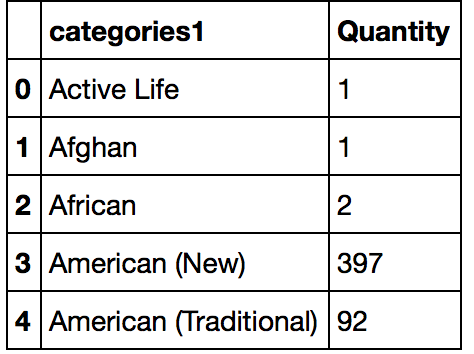 


```sh
df4=df2.groupby(["categories1"],as_index=False).mean()
df4.head()
```
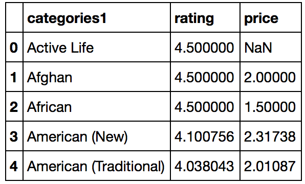


merge two dataframe 


```sh
df_rpq=pd.merge(dd,df4,on='categories1')
df_rpq.head()

```
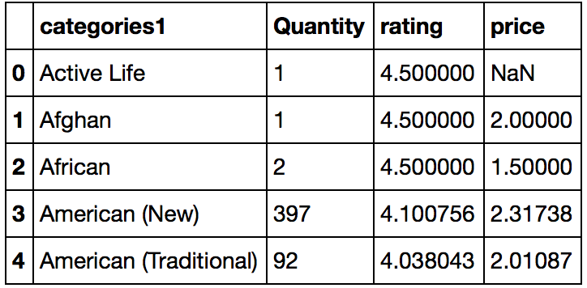

- 5 Further analyzing and selecting those restaurant categories that are more than 20 and make show with matplotlib.
Using df.query() to select dataframe

```sh
df_ByQu=df_rpq.sort_values(["Quantity"],ascending=[False])

df_result=df_ByQu.query('Quantity>20')
df_result.head()


```

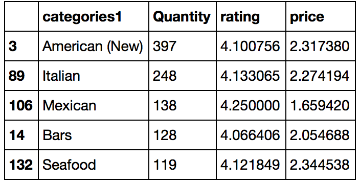


- Restaurant Category OverView from 7 Big City
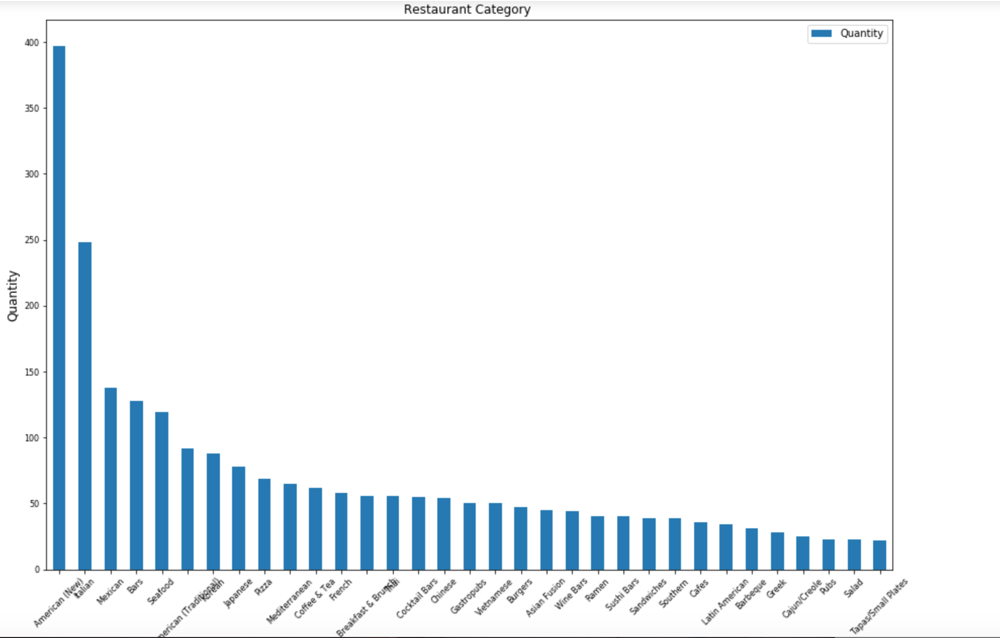


- Relationship between Price and Rating

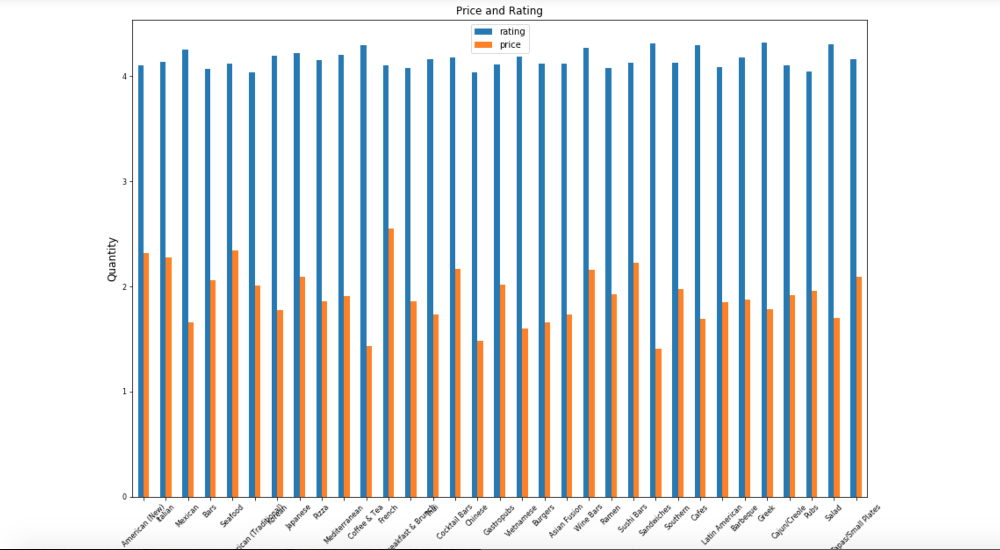


#### Conclusion
   Most people will prefer to offer higher rating to some cheap and fast food shop.


### Analysis 2
- plotting real NewYork Map according to different price rating.

#### Main Process :
- 1 get all New York json files and write them to csv file. Read newyork restaurant.csv.
```sh
df=pd.read_csv((os.getcwd()+'/NY-restaurant.csv'),low_memory=False)
df=df.drop_duplicates()
df.head()
```
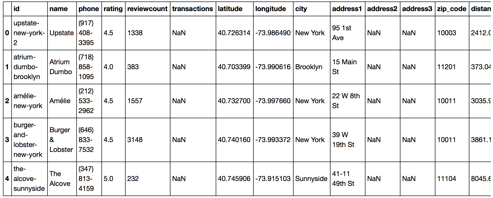

- 2 cleaning data and combining latitude and longitude 

```sh
df2['lat_long']=df2[["latitude","longitude"]].apply(tuple,axis=1)
df2.head()
```
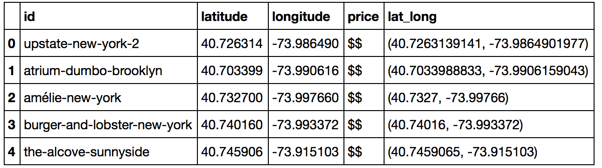

- 3 Classifing restaurants according to price level. 

```sh

df_1star=df2.query("price=='$'")
df_2star=df2.query("price=='$$'")
df_3star=df2.query("price=='$$$'")
df_4star=df2.query("price=='$$$$'")
list1=df_1star['lat_long'].values.tolist()
list2=df_2star['lat_long'].values.tolist()
list3=df_3star['lat_long'].values.tolist()
list4=df_4star['lat_long'].values.tolist()

```

- 4 Using folium package to marking the New York map. Different color means different price level.($:blue $$:red $$$:green  $$$$:yellow )

```sh
lat = +40.7128
lon = -74.0059
zoom_start = 14

m = folium.Map(location=[lat, lon], zoom_start=zoom_start)

def plotmap(l1,l2,l3,l4,m):
    kw = dict(fill_color='blue', radius=3)
    kw1=dict(fill_color='red', radius=3)
    kw2=dict(fill_color='green', radius=3)
    kw3=dict(fill_color='yellow', radius=3)
    for ll in l1:
        c=folium.CircleMarker([ll[0], ll[1]], **kw)
        m.add_child(c)
    for ll in l2:
        c=folium.CircleMarker([ll[0], ll[1]], **kw1)
        m.add_child(c)
    for ll in l3:
        c=folium.CircleMarker([ll[0], ll[1]], **kw2)
        m.add_child(c)
    for ll in l4:
        c=folium.CircleMarker([ll[0], ll[1]], **kw3)
        m.add_child(c)    
    m.save('Restaurant.html') 
    return m

```
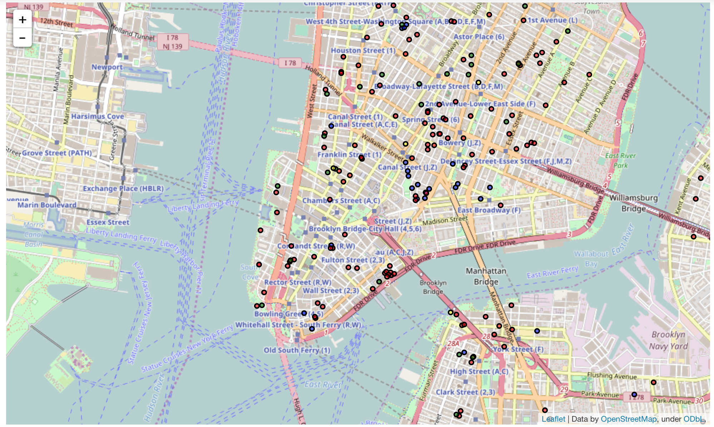

### Analysis 3
- Analyzing restaurant review data and exploring people's attention to restaurant-- place,food,service.

#### Main Process :
- 1 get all New York json files and write them to csv file. Read newyork restaurant.csv.
```sh
df=pd.read_csv((os.getcwd()+'/restaurant.csv'),low_memory=False)
df=df.drop_duplicates()

df.head()
```
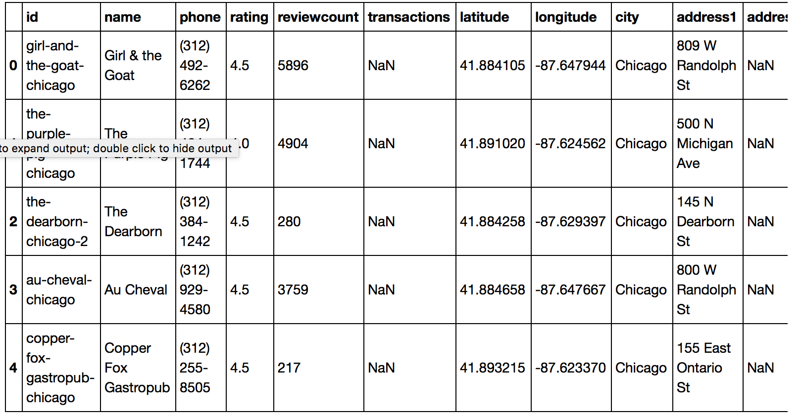

- 2 get all restaurants that reviews are more than 300
```sh
df_byrating=df1.sort_values(["rating"],ascending=[False])
df_ana=df_byrating.query('reviewcount>300')
df_ana.head()
```
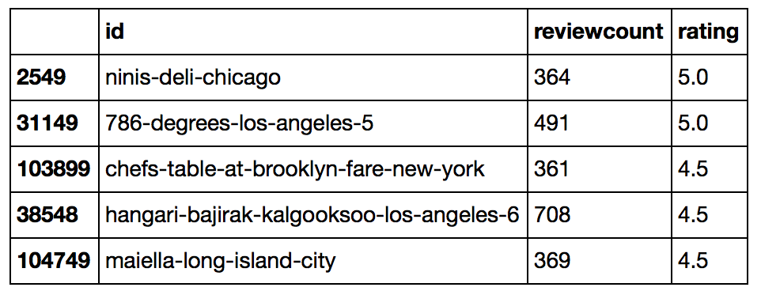

- 3 using yelp review api to get review of all restaurants. Store them as json files.
```sh

def get_chunks2(MyList, n):
    return [MyList[x:x+n] for x in range(0, len(MyList), n)]

def writejson(name,r):    
    with open(os.getcwd()+"/raw data/Restaurant_Review/"+name+'.json', 'w',encoding='utf-8',errors='ignore') as outfile:
        json.dump(r, outfile)

def combineReviewJson():
    list1=get_chunks2(Idlist, 20)
    for li in list1:
        reviewdict={}
        review=[]
        for l in li:
            url = 'https://api.yelp.com/v3/businesses/'+l+'/reviews'
            r=requests.get(url=url,headers=headers)
            review.extend(r.json()["reviews"])
        reviewdict["reviews"]=review
        writejson(l[0]+l[1]+l[2]+l[3]+l[4],reviewdict)

```

- 4 Using NLTK method to clean review data and store them by ratings(5,4,3,2,1)

```sh
def getstarreview(path,star):
    wordlist=[]
    dic=readjson(path)["reviews"]
    for eachrest in dic:
        if eachrest["rating"]==star:
            wordlist.extend(cleanword(eachrest["text"]))
    return wordlist 


```
- 5 make word frequency according different star review(rating:5 rating:4 ..... ) and output dataframe

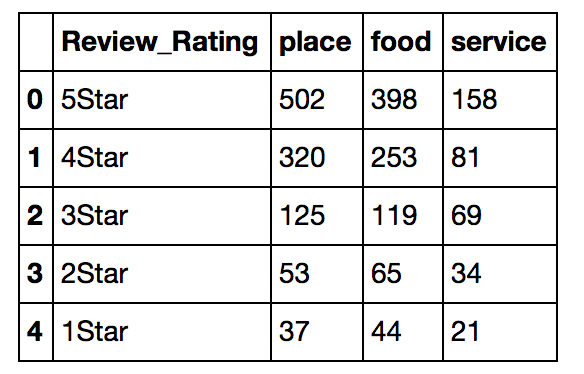

- 6 make fig with matplotlib 


- 7 make word cloud


#### Conclusion
 
 The distribution bar chart above shows the concerning extent of customer. The analysis provides restaurant with some advices. At the most time, customers prefer to give 5 star rating when place is good. The second is food. The third is service. For high rating level, a clean and good place for dinner seems more important.
