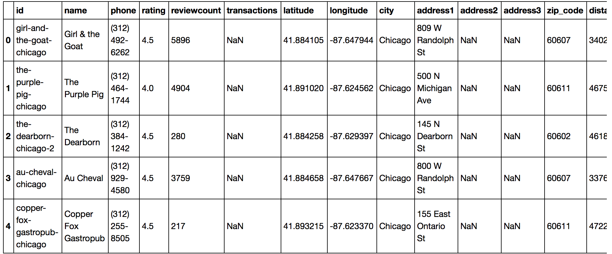

# Final Exam - Spring 2017 
## Overview:
Yelp API to make 3 analysis about restaurant.  


### Analysis 1
-  Collecting and Store restaurant data and exploring price and rating factor to restaurant.
-  Using matlibplot to show result.

#### Process :
- 1  Apply for yelp api key and collect 7 big city main restaurants data(Chicago,Los angeles,Boston,Hoston,New York,Philadelphia,Seattle) and save them as json files.
```sh
def collectdata(offestlist):
    for num in offestlist:      
        params = {'location': 'Houston',
                   'term':'Restaurants',
          'offset':num,
         'limit':50
           }
        r=requests.get(url=url,params=params,headers=headers)
        writejson(num,r.json())
```        
- 2 Read restaurant data and write them to one csv file
 
```sh
def writecsv(x):
    with open(os.getcwd()+"/restaurant.csv", 'a') as outcsv:      
        writer=csv.writer(outcsv,delimiter=',', quotechar='|',quoting=csv.QUOTE_MINIMAL, lineterminator='\n')   
        ree=x["businesses"]
        for item in ree:
            c1=item["id"].replace(","," ")
            c2=item["name"].replace(","," ")
            c3=item["display_phone"]
            c4=item["rating"]
            c5=item["review_count"]
            if len(item["transactions"])==0:
                c6=None
            else:            
                c6=item["transactions"][0]
            c7=item["coordinates"]["latitude"]
            c8=item["coordinates"]["longitude"]
            c9=item["location"]["city"].replace(","," ")
            if item["location"]["address1"]==None:
                c10=None
            else:
                c10=item["location"]["address1"].replace(","," ")
            if item["location"]["address2"]==None:
                c11=None
            else:
                c11=item["location"]["address2"].replace(","," ")
            if item["location"]["address3"]==None:
                c12=None
            else:
                c12=item["location"]["address3"].replace(","," ")    
            c13=item["location"]["zip_code"].replace(","," ")
            c14=item["distance"]
            if len(item["categories"])>2:
                c15=item["categories"][0]["title"].replace(","," ")
                c16=item["categories"][1]["title"].replace(","," ")
                c17=item["categories"][2]["title"].replace(","," ")
            if len(item["categories"])==2:
                c15=item["categories"][0]["title"].replace(","," ")
                c16=item["categories"][1]["title"].replace(","," ")
                c17=None
            if len(item["categories"])==1:
                c15=item["categories"][0]["title"].replace(","," ")
                c16=None
                c17=None  
            if len(item["categories"])==0:
                c15=None
                c16=None
                c17=None 
            if 'price' not in item:
                c18=None
            else:
                c18=item['price']
            writer.writerow([c1,c2,c3,c4,c5,c6,c7,c8,c9,c10,c11,c12,c13,c14,c15,c16,c17,c18])
```
- 3 User pandas module to read csv file and remove duplicating restaurant information.(restaurant.csv)

```sh
df=pd.read_csv((os.getcwd()+'/restaurant.csv'),low_memory=False)
df=df.drop_duplicates()
df.head()
```



- 4 Quantizating price with number and Caculating average price and rating for each category of restaurant.
Replace $ with 1....
```sh
df2['price']=df2['price'].replace('$$',2)
df2['price']=df2['price'].replace('$',1)
df2['price']=df2['price'].replace('$$$',3)
df2['price']=df2['price'].replace('$$$$',4)
df2['price']=df2['price'].replace('$$$$$',5)
df2.head()
```


Get restaurant quantity for each category(Thai food , French food )
```sh
df3=df2.copy()
df3['Quantity']=1
dfcount=df3[["categories1","Quantity"]]
dfcount.head()
dd=dfcount.groupby(["categories1"],as_index=False).count()

```
 


```sh
df4=df2.groupby(["categories1"],as_index=False).mean()
df4.head()
```


merge two dataframe 
```sh
df_rpq=pd.merge(dd,df4,on='categories1')
df_rpq.head()

```

- 5 Further analyzing and selecting those restaurant categories that are more than 20 and make show with matplotlib.
Using df.query() to select dataframe
```sh
df_rpq=pd.merge(dd,df4,on='categories1')
df_rpq.head()

```


Restaurant Category OverView from 7 Big City


Relationship between Price and Rating


#### Conclusion
   Most people will prefer to offer higher rating to some cheap and fast food shop.


#### Analysis 2
- 1 Analyze important Email Receiver Content and get high frequency word list and output csv.


#### Process :
- 1 Read Email content and get all clean words.

```
vipfilenamelist=["shapiro-r","dasovich-j","jones-t","kean-s","shackleton-s"]

def cleanword(rawcontent):
    wordlist=[i for i in word_tokenize(rawcontent.lower()) if i not in stopwords.words('english') and i not in string.punctuation and i.isalpha()]
    return wordlist
```
- 2 List all high frequency word and output CSV
```
[('enron', 13252),
 ('said', 5871),
 ('company', 5641),
 ('power', 4329),
 ('message', 4060),
 ('would', 3980),
 ('energy', 3936),
 ('sent', 3737),
 ('subject', 3715),
 ('please', 3484),
 ('new', 3446),
 ('http', 3342),
 ('gas', 2736),
 ('jones', 2524),
 ('may', 2396),
 ('pm', 2391),
 ('td', 2276),
 ('business', 2257),...]
```
- 2 Caculate Email Distribution per Month.
```sh


```
- it will get Email distribution
```


```
- 3 use matplotlib to make graphic 


#### Analysis 3

- 1 Analyze hot and important words distribution per half month and output Graphic.

#### Process :
- 1 Choose some hot topic words from Analysis 2 high frequency word list.
```
{enron, gas, price, power,company,energy,trading,service,credit}
```
- time range: first means first half of month, second means second half of month
```
["2001-7-first","2001-7-second","2001-8-first","2001-8-second","2001-9-first","2001-9-second","2001-10-first","2001-10-second","2001-11-first","2001-11-second","2001-12-first","2001-12-second","2002-1-first","2002-1-second","2002-2-first","2002-2-second","2002-3-first","2002-3-second"]

```
- 2 Get wordlist per half month

- split a month to two parts
```sh
def returnmaildate(path):                       #  mail date        
    with open(path, 'r',encoding='utf-8',errors='ignore') as exa:
        content=exa.read()
        email=Parser().parsestr(content)
        t=parsedate_tz(email["date"])
        if t[2]<16:
            q="first"
        else:
            q="second"
        return (str(t[0])+"-"+str(t[1])+"-"+q) 

def getallemailwordslist(path,date):
    wordlist=[]
    filespath=getallfile(path)
    for eachfilepath in filespath:
        if returnmaildate(eachfilepath)==date:         
            words=cleanword(getemailcontent(eachfilepath))
            wordlist.extend(words)
    return wordlist 

def getwordpermonth(date):
    wordbase=[]
    for path in vippath(vipfilenamelist):
        wordbase.extend(getallemailwordslist(path,date))
    return wordbase  
        
```
- 3 output word frequency about important words
```

```
---
### Question 2 : 

#### Analysis 1  with BOOK API
- Analyze best seller book list in New York Times(Combined Print and E-Book Fiction list)


#### Process
- 1 write function to collect book information data according date
```
def getbooklist(datelist,booktype):
    for pubdate in datelist:
        r = requests.get("https://api.nytimes.com/svc/books/v3/lists/"+pubdate+"/"+booktype+".json?&api-key="+os.getenv('auth_key'))
        writejson(pubdate,booktype,r.json()) 
```

- 2 Analyze book author and title to caculate their times on best seller list.
```

```
- 3 output csv


#### Analysis 2  with BOOK API
- Analyze the most popular publishers seller book list (Combined Print and E-Book Unfiction list)


#### Process
- 1 Get unfiction book information (collected in Analysis 1)

- 2 Get all titles and author information from top 250 book in unfiction book list from 2011 to 2017
```


```
- 3 Use GET /lists/best-sellers/history.json to collect publishers information of top 250 best seller books
```sh
def getbookinfo(title,author):
    params={'api-key':os.getenv('auth_key'),'author':author,'title':title}
    r = requests.get("https://api.nytimes.com/svc/books/v3/lists/best-sellers/"+title+"-"+author+".json",params=params)
    writejson(title,author,r.json())
```
- 4 Clean data and analyze frequency of publishers to ensure the most popular publishers.

```sh
cleandata=[]
for pub in allpublisher:
    pub=pub.replace("Random House Publishing","Random House")
    pub=pub.replace("Publishers","")
    pub=pub.replace("House ","House")
    pub=pub.replace("St. Martin’s","St. Martin's")
    pub=pub.replace(","," ")
    pub=pub.replace("Editions","")
    pub=pub.replace("Threshold ","Threshold")
    pub=pub.replace("Little, Brown","Little Brown")
    pub=pub.replace("HarperCollins","HarperCollins ")
    pub=pub.replace("HarperCollins","HarperCollins ")
    #Threshold Editions/Mercury Radio Arts------>Threshold Editions and Mercury Radio Arts
    if "/" in pub:
        for i in pub.split("/"):
            cleandata.append(i)
    else:
        cleandata.append(pub)
```
```
('Random House', 20),
 ('Simon & Schuster', 15),
 ('Little  Brown', 14),


```

- 5 Output CSV

#### Analysis 3  with Archive API
- Analyze article type distribution from 2014 to 2017

#### Process
- 1 Write requests to collect archive data
```sh
def getjson(startmonth,startyear,endmonth,endyear):
    for date in months(startmonth,startyear,endmonth,endyear):
        r = requests.get("https://api.nytimes.com/svc/archive/v1/"+str(date[1])+"/"+str(date[0])+".json?&api-key="+os.getenv('auth_key'))
        writejson(date[1],date[0],r.json())  


```

- 2 Analyze article type proportion
```sh
typedistrbution=[]
for eachtype in articletype:
    typedistrbution.append((eachtype[0],eachtype[1]/len(typelist)))
    
    
typedistrbution  
```

```

- 3 output csv


